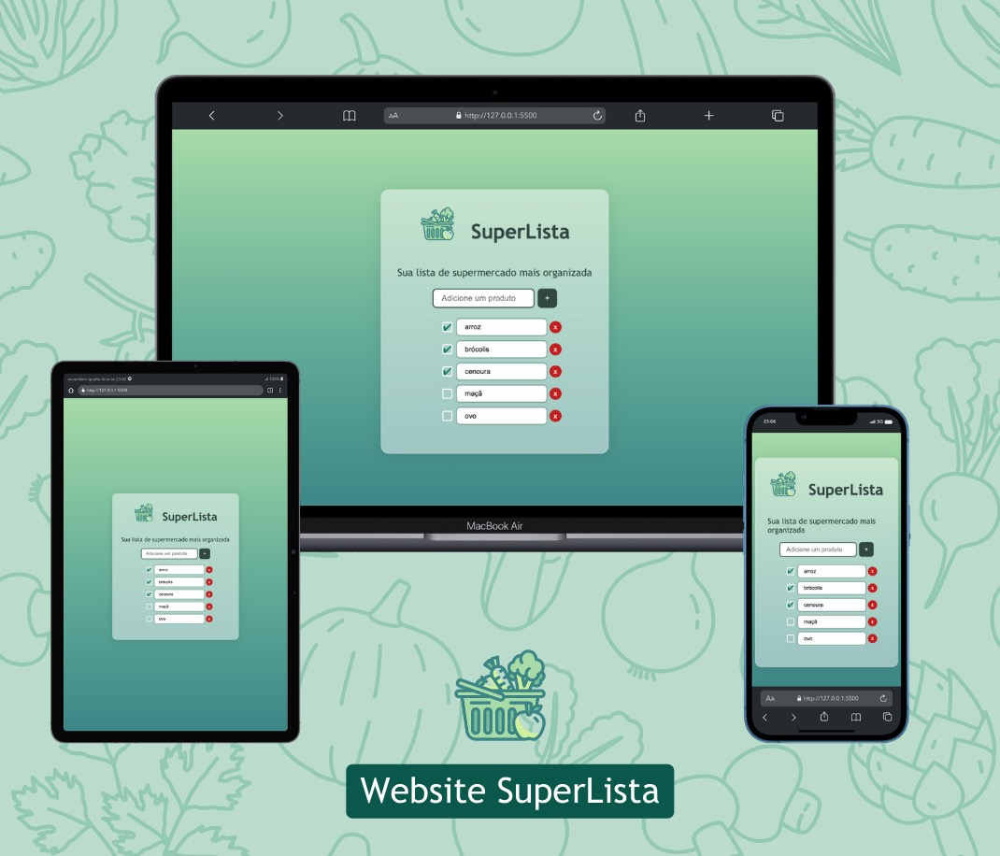

# SuperLista - Projeto de Estudo

Bem-vindo ao repositório SuperLista, uma aplicação web simples desenvolvida como parte de um projeto de estudo. Esta aplicação permite ao usuário criar listas personalizadas, adicionando, apagando, editando e marcando itens com um check. O projeto utiliza as seguintes tecnologias: HTML, CSS e JavaScript.

## Funcionalidades

1. **Adicionar Item:**
   - Os usuários podem adicionar novos itens à lista.

2. **Apagar Item:**
   - Itens indesejados podem ser removidos da lista.

3. **Editar Item:**
   - Os usuários têm a opção de editar o conteúdo de um item existente na lista.

4. **Marcar com Check:**
   - Uma funcionalidade de marcação permite aos usuários indicar que um item foi concluído ou verificado.

## Como Usar

1. Clone o repositório para sua máquina local:

   ```bash
   git clone https://github.com/seu-usuario/SuperLista.git
   ```

2. Abra o arquivo `index.html` no seu navegador web para começar a usar a aplicação.

## Estrutura do Projeto

- **index.html:** Contém a estrutura HTML da aplicação.
- **style.css:** Arquivo de estilo para a aparência visual da aplicação.
- **script.js:** Lógica da aplicação em JavaScript.


